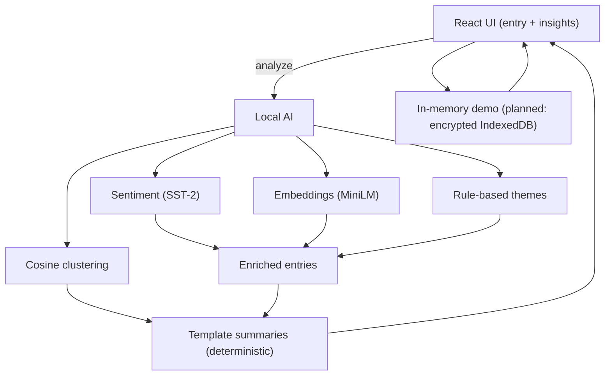

# Reflector — Design Document

## Executive Summary
Reflector is a privacy-first, AI-powered journaling companion that helps users build consistent reflection habits while uncovering meaningful patterns in their emotional life. Designed to run on-device with small, local models, Reflector keeps your data private while still providing adaptive prompts, semantic tags, and gentle summaries grounded in your own entries.

---

## 1. Problem Statement

### The Blank Page Problem
Journaling is widely recognized as beneficial for mental health, but most people struggle to sustain the habit:

| Challenge | Impact |
|----------|--------|
| Blank page anxiety | Users don’t know where to begin |
| Event logging vs. reflection | Entries lack emotional depth and intention |
| No pattern recognition | Users overlook trends or recurring themes in their own lives |
| Privacy concerns | Fear of intimate thoughts being exposed or stored externally |

---

## Our Solution
A supportive, intelligent journaling system that helps users reflect deeply while maintaining full control of their data.

### Core Capabilities
- **Prompts with context:** AI-generated questions informed by recent entries to help users start writing with purpose.  
- **Analyzes locally:** All sentiment, emotion, and theme detection happens on-device to protect user privacy.  
- **Visualizes patterns:** Mood trends, theme correlations, and emerging topics are displayed in minimal, user-friendly summaries.  
- **Insightful reflection summaries:** Weekly or monthly, Reflector highlights key themes, shifts, and moments of progress.  

Example:  
> “You wrote most often about feeling energized on days you took a morning walk. You also noted more creative ideas during those weeks.”

These summaries help users connect the dots in their own lives without manual effort.

### Commitment to Privacy
- Zero external data transmission  
- Fully encrypted storage  
- All analysis runs locally on-device  

### Engagement goals (PoC)
- Make daily writing effortless: context-aware prompt sits above the entry box.
- Reward consistency with weekly insights instead of streak shaming.
- Keep the UI calm and non-judgmental; no public feeds, no social pressure.
- Show quick wins: newest entries first with immediate tags and mood readouts.

---

---

## 2. System Overview

Reflector is designed as a lightweight, privacy-preserving journaling system that runs locally. The architecture is intentionally simple, fast, and modular:

### UI (React/TypeScript)
- Minimal writing interface with a context-aware prompt above the entry box
- Views for entries (newest-first) and on-demand insights
- No text leaves the device; all analysis is local

### Local AI (transformers.js)
- Sentiment: `Xenova/distilbert-base-uncased-finetuned-sst-2-english`
- Embeddings: `Xenova/all-MiniLM-L6-v2` for similarity/clustering
- Theme tagging: rule-based semantic tags (energized, stressed, creative, rest, etc.) derived from text + sentiment
- Insights: deterministic templates over per-entry signals, activity cues, and embedding clusters (no text generation at runtime)

### Data layer (current state)
- In-memory store seeded with mock data; new entries stay local for the session
- No persistence yet; IndexedDB + encryption (Web Crypto) is a planned enhancement
- No external transmission of text or metadata

---

## 3. Technical Approach

### **On-Device NLP Pipeline**
Reflector integrates small Hugging Face models through transformers.js to process journal text locally:

1) **Sentiment**: classify each entry (pos/neu/neg + score) with `distilbert-base-uncased-finetuned-sst-2-english`.  
2) **Embeddings**: convert each entry to a vector via `all-MiniLM-L6-v2` for cosine similarity.  
3) **Themes & clustering**: semantic tags from rule-based cues; cluster similar entries via cosine similarity to surface recurring topics.  
4) **Insight generation**: deterministic, template-based bullets grounded in the above signals (e.g., “Outdoors entries paired with better tone,” “Creative sessions showed up; capture ideas right after.”). No generative text leaves the models, and no remote calls happen after model download.

---

### **Contextual Prompt Engine**
- Uses the latest tagged entry to nudge writing (e.g., stressed → “What eased the stress?”, creative → “Capture the spark,” rest → “What made rest restorative?”).
- No text generation; prompts are deterministic and local.

---

### **Data Model Design**

```ts
export type ThemeTag =
  | "energized" | "tired" | "drained" | "stressed" | "calm" | "anxious"
  | "creative" | "social" | "rest" | "focused" | "grateful";

export type JournalEntry = {
  id: string;
  createdAt: string;
  text: string;
  sentiment?: "positive" | "neutral" | "negative";
  sentimentScore?: number;
  embedding?: number[];
  tags?: ThemeTag[];
};

export type InsightSummary = {
  id: string;
  period: "weekly" | "monthly";
  insights: string[];
  averageSentiment: number;
  themeKeywords: string[];
  generatedAt: string;
};
```

---

## Technical Stack
- **Language/Framework**: TypeScript + React
- **AI runtime**: transformers.js (`@xenova/transformers`)
- **Models**: SST-2 for sentiment; MiniLM for embeddings; rule-based themes/insights
- **Styling/build**: CSS modules in-app; Vite for dev/build

## Security & Privacy
- All NLP runs locally in the browser; no text leaves the device after model download.
- No external telemetry; only initial model fetch if not cached.
- Planned storage hardening: encrypted IndexedDB for entries/embeddings/summaries with Web Crypto; keys remain client-side. No server round-trips.
- Model integrity: pin model IDs/versions; consider bundling weights locally or serving from a trusted origin to avoid remote fetch at runtime.
- Explainability: deterministic themes and template summaries make outputs auditable; sentiment/tags/embeddings are inspectable per entry.
- Auth (future): optional local-first login (device/biometric). If cloud sync is ever added, encrypt client-side with user-held keys so plaintext never leaves the device.

### Model loading considerations
- Hugging Face models via transformers.js can be heavy to fetch/compile in-browser. First-load latency depends on network and device; caching helps, but offline bundling or local hosting is recommended for reliability.
- WASM/ONNX performance varies by device; quantized variants and web workers can reduce UI stalls. Pooling embedding requests and limiting to recent entries keeps compute bounded.
- If remote fetch is blocked, a bundled or pre-cached model is needed to avoid failures; graceful error messages are important.

## Future Enhancements
- **Persistence**: encrypted IndexedDB for entries/embeddings/summaries; local keys only.
- **Better themes**: add a small zero-shot classifier to refine tags per user and reduce rule bias.
- **Richer clustering**: label clusters with exemplar sentences; show “related entries” per note.
- **Offline/cache strategy**: bundle models with the app or serve from a trusted local origin; prewarm/cache to avoid first-load hiccups.
- **Performance**: quantized models, web workers for inference, pooling/limiting embeddings to recent N entries.
- **Personalization**: per-user tag weighting and prompt tuning based on their history (still local-only).
- **Robustness**: clearer error UX when models can’t load; fallback to last-known tags/summaries without sending data off-device.
- **Auth (future)**: optional local-first login with biometric/device credentials; never store raw entries off-device. If cloud sync is added, encrypt client-side with user-held keys; no server access to plaintext.
- **Engagement experiments**: gentle streaks, “return tomorrow” nudges, and small prompt rotations based on recent themes—always opt-in and local.

## Architecture (Mermaid)

